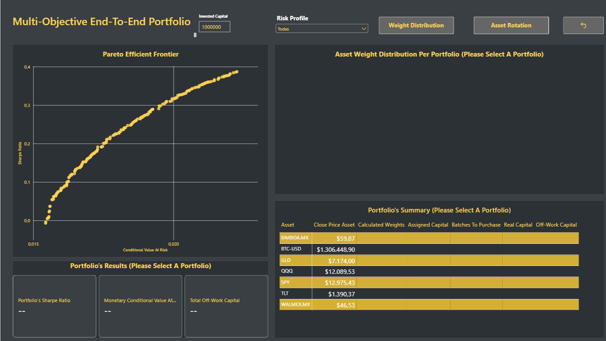

# End-To-End-Multi-Objective-Portfolio-Optimization
End-To-End Multi-Objective Portfolio Optimization System combining GRU (Gated-Recurrent-Unit) Neural Networks, NSGA-II Genetic Algorithms (pymoo), Relational SQLite Architecture, Dynamic Lot Discretization, and Interactive Power BI Analytics.

## Dashboard Preview



## Key Components

- **Multi-Objective Optimization Engine (Python):** Implementation of the NSGA-II algorithm via pymoo to simultaneously maximize the Sharpe Ratio and minimize the Conditional Value at Risk (CVaR) across 200 portfolio candidate solutions forming the Pareto Efficient Frontier.
- **Adaptive Deep-Learning (Python):** GRU Neural Network Model that predicts whether the actual return is greater than the moving average of 5 days prior, to take decisions regarding current finantial position for each asset and get expected returns based on Long and Short probability.
- **Data Governance And Relational Architecture (SQL):** 3-Table Relational Schema stored in a SQLite database (Portafolios_Optimos_Con_Perfil, Pesos_Optimos_Por_Ticker, and Precios_De_Activo), designed to support normalized DAX relationships without data duplication.
- **Dynamic Capital Allocation & Lot Discretization (Power BI):**  Financial execution engine built with DAX that converts continuous calculated weights ($w_i$) into real integer share purchases based on dynamic user-defined capital inputs, automatically calculating off-work capital.
- **Interactive Visual Analytics (Power BI):** Dark-themed institutional dashboard featuring interactive bookmarks for asset distribution vs. rotation, active profile slicers, and cross-filtering between the Pareto frontier scatter plot and execution tables.

## Portfolio Key Metrics Summary

| Risk Profile Strategy | Sharpe Ratio | Monetary CVaR (95%) | Primary Asset Allocation |
| :---: | :---: | :--- | :--- |
| **Max Sharpe** | Highest Efficiency (0.39) | Balanced Risk (2.226% of Invested Capital) | Higher Weight in GLD/TLT |
| **Min CVaR** | Lowest Efficiency (-0.01) | Lowest Tail Risk (1.554% of Invested Capital) | Capital Preservation |
| **Knee** | Optimal Trade-0ff (0.22) | Optimized Risk (1.775% of Invested Capital) | Balanced Multi-Asset Mix |

- **Highest Usage Assets:** GLD, TLT. (Low Volatility Assets)
- **Lowest Usage Assetes:** QQQ, BTC-USD. (High Volatility Assets)

## Technology Stack 

**Programming Language:** Python 3.10+

**Optimization Framework:** pymoo (NSGA-II Algorithm)

**Quantitative Analysis:** Pandas, NumPy, SciPy

**Database Architecture:** SQL, SQLite3, SQLAlchemy

**Business Intelligence & Financial DAX:** Power BI Desktop (Bookmarks, Custom Tooltips, Advanced DAX Measures)

## Execution Flow

1. **Neural Network  Signals & Data Fetching:** Historical asset pricing and predictive signals generated from the GRU Quantitative Trading System pipeline are imported into the portfolio optimization module.
2. **NSGA-II Evolutionary Optimization:** Execution of the multi-objective genetic algorithm to solve weight allocation constraints ($\sum w_i = 1.0$, $0 \le w_i \le 0.35$) across return efficiency and downside tail-risk metrics.
```bash
   python 03_Multi_Objective_Portfolio_Pipeline/multi_objective_portfolio_pipeline.py
 ```
3. **Relational Database Storage:** Population of the SQLite database (Optimal_Pymoo_Portfolios.db) exporting the normalized fact and dimension tables.
4. **Power BI Dashboard Deployment:** Integration with Power BI via DirectQuery / Import to execute dynamic lot sizing, real-time risk profile evaluation, and visual trade-off analysis.

## Demo Video

[](https://github.com/brebollarj771777-droid/End-To-End-Multi-Objective-Portfolio-Optimization/raw/main/Multi_Objective_Portfolio.mp4)
